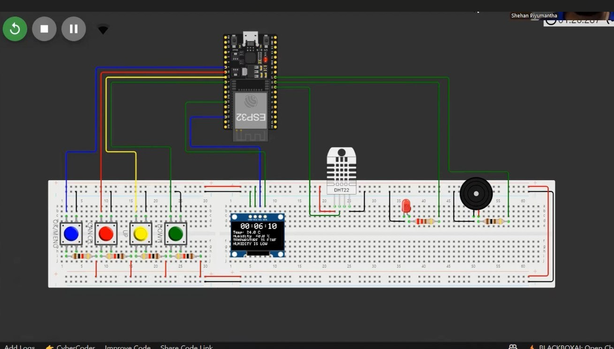

# Smart MediBox – Smart Medication Reminder System (Part 01)

---

## 🖼 Circuit Diagram

---

## 📌 Overview
**MediBox** is a smart medication reminder system designed to assist patients in taking their medications on time. The device features:

* **OLED display** for user interface  
* **DHT22 sensor** for monitoring temperature and humidity  
* **Buzzer and LED notifications** for reminders  
* **Wi-Fi connectivity** for NTP time synchronization  

This system is built using an **ESP32 development board** to ensure accurate timekeeping and reliable performance.

---

## 👤 Author
**Name:** Piyumantha W.A.S  
**Index Number:** 220483D  

---

## 🛠️ Libraries Used
* `Wire.h` – I2C communication  
* `Adafruit_GFX.h` – Graphics library for display  
* `Adafruit_SSD1306.h` – OLED display control  
* `DHTesp.h` – DHT22 sensor library  
* `WiFi.h` – Wi-Fi connectivity  

---

## 🔧 Hardware Components
* **ESP32 Development Board**  
* **OLED Display (128x64 pixels)**  
* **DHT22 Sensor**  
* **Buzzer**  
* **LEDs**  
* **Push Buttons**  

---

## ✅ Key Functionalities
* **Time Synchronization**  
  Syncs with an NTP server for accurate timekeeping.  

* **Alarm System**  
  Allows multiple alarms to remind users to take medication.  

* **Temperature & Humidity Monitoring**  
  Displays real-time values from the DHT22 sensor on the OLED screen.  

* **User Interaction**  
  Configure alarms and time zones using push buttons.  

* **Notifications**  
  Audible (buzzer) and visual (LED) alerts when it's time for medication.  

---

## 📐 Circuit & Design Files
* **Circuit Diagram** –   
* **Schematic Diagram** – *(Add image link here)*  
* **PCB Layout** – *(Add image link here)*  
* **2D View** – *(Add image link here)*  
* **Printed Circuit Board (PCB)** – *(Add image link here)*  

---

## 🚀 Usage Guide
### 1. Setup
* Connect hardware as per the schematic.  
* Upload the code to the ESP32 board.  
* Power on the device.  

### 2. Connecting to Wi-Fi
* The device will auto-connect to a predefined Wi-Fi network.  
* Ensure your Wi-Fi credentials in the code match your network.  

### 3. Setting Time Zone
* Navigate to **Set Time Zone** mode using push buttons.  
* Adjust hour and minute offsets as required.  

### 4. Setting Alarms
* Navigate to **Alarm Settings** mode.  
* Configure alarm times using push buttons.  

### 5. Monitoring Temperature & Humidity
* Continuous monitoring via DHT22 sensor.  
* Alerts shown on OLED if values exceed thresholds.  

### 6. Alarm Notifications
* Buzzer sounds and LED lights up when alarm triggers.  
* Press **Cancel** button to stop the alarm.  

---

## 🌐 Simulation
View and test this project on Wokwi:  
👉 [**Open Wokwi Simulation**](https://wokwi.com/projects/426754863944303617)

---

## 🔮 Future Improvements
* Add a mobile app for remote monitoring  
* Implement voice notifications  
* Support for multiple users and medicine schedules  

---

